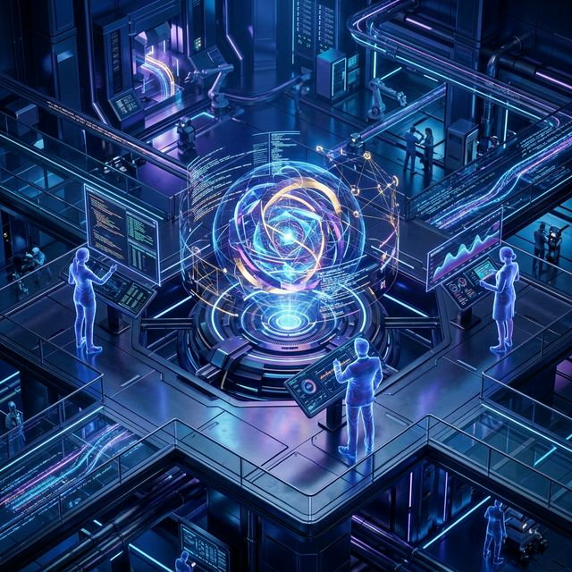

# 🌌 gstack Specialist Roles & Prompt Library: Your AI Software Factory by Garry Tan

<div align="center">


[English](#english-version) | [中文说明](README_zh.md)


</div>

---

<br/>

<a name="english-version"></a>

> "I am shipping more code than I ever have before. In the last 60 days, I've written over 600k lines of production code part-time." —— **Garry Tan**, CEO of Y Combinator

`gstack` is the definitive open-source **"AI software factory"** by Garry Tan. This repository provides deep-extracted **prompt templates** and **specialist roles** to transform AI assistants like **Claude Code**, **Codex**, and **Gemini** into a full-scale **Virtual Engineering Laboratory**.

---

## 🏗️ Core Workflow: The AI Sprint & LLM Orchestration

gstack is more than just tools; it's a rigorous software development process.

```text
    [ Requirement ]
         |
         v
    [/office-hours] (Product Ideation) ----> [ Output: DESIGN.md & Plan ]
         |                                     |
         +-----------------|-------------------+
                           v
                  [ Triple-Audit Gate ]
         +-----------------+-----------------+
         | [/plan-ceo]     | [/plan-eng]     | [/plan-design]
         | (Strategy)      | (Architecture)   | (Visual Soul)
         +-----------------+-----------------+
                           |
                           v
                    [ AI Development ] <-------- [/debug] (Investigation)
                           |           <-------- [/design-review] (UI Fix)
                           v
                    [ Funnel Audit ]
         +-----------------+-----------------+
         | [/review]       | [/cso]          | [/qa]
         | (Logic)         | (Security)      | (Browser Test)
                           |
                           v
                    [ /ship & /retro ]
```

---

## 🧠 Builder Ethos

The soul of gstack lies in these three core tenets:

> [!IMPORTANT]
> ### 1. Boil the Lake
> In the AI era, the cost of absolute completeness is nearly zero. If a feature requires 100% test coverage and exhaustive error analysis (Boil the Lake), AI makes "perfect implementation" extremely cheap. Never take shortcuts; build the full robust system because the machine can handle the fatigue.

> [!TIP]
> ### 2. Search Before Building
> A 1000x engineer's first instinct is to find a proven pattern rather than reinvent the wheel. Always look for time-tested patterns or emerging trends (search-first) before first-principles analysis.

### 📊 Compression Ratio Table

| Task Type | Traditional Team | AI-Powered Builder | Boost Ratio |
| :--- | :--- | :--- | :--- |
| **Boilerplate** | 2 Days | 15 Minutes | **~100x** |
| **Unit Tests** | 1 Day | 15 Minutes | **~50x** |
| **Implementation** | 1 Week | 30 Minutes | **~30x** |
| **Architecture** | 2 Days | 4 Hours | **~5x** |

---

## 🎭 The 13 AI Specialist Roles & Prompt Templates

This repository contains the deep-extracted prompt templates for the core engineering roles.

| Category | Role & Link | Shortcut | Mission |
| :--- | :--- | :--- | :--- |
| **Strategy** | [01. CEO Product Thinker](en/01_CEO_Product_Thinker.md) | `/office-hours` | Refine vision via "6 Soul Questions." |
| | [02. CEO Product Reviewer](en/02_CEO_Product_Reviewer.md) | `/plan-ceo-review` | Audit for "10-star experience" & scope control. |
| | [03. Engineering Manager](en/03_Engineering_Manager.md) | `/plan-eng-review` | Technical rigor, architecture & test plan. |
| **Skill** | **Master Orchestrator** | **`/autoplan`** | **Built-in: One-click CEO -> Design -> Eng Review.** |
| **Design** | [04. Visual Designer Auditor](en/04_Visual_Designer_Auditor.md) | `/plan-design-review` | High-fidelity UI/UX audit & state coverage. |
| | [05. Visual Designer Consultant](en/05_Visual_Designer_Consultant.md) | `/design-consultation` | Build bold, unique design systems & visual soul. |
| **Review** | [06. Code Senior Reviewer](en/06_Code_Senior_Reviewer.md) | `/review` | PR audit, logic safety & performance. |
| | [07. Investigation Specialist](en/07_Investigation_Specialist.md) | `/debug` | Systematic root-cause (No Guessing allowed). |
| **Skill** | **Adversarial Auditor** | **`/codex`** | **Built-in: Cross-model audit using OpenAI Codex.** |
| **Implementation**| [08. Design Implementation](en/08_Design_Implementation.md) | `/design-review` | Pixel-perfect UI/CSS visual fixes & offsets. |
| **Automation** | [09. QA Lead Tester](en/09_QA_Lead_Tester.md) | `/qa` | Automated Chromium headless tests & bug fix. |
| **Skill** | **Browser Ninja** | **`/browse`** | **Built-in: Ultra-fast headless interaction & cookie import.** |
| **Governance** | [10. Chief Security Officer](en/10_Chief_Security_Officer.md) | `/cso` | OWASP/STRIDE audit & secret/leak scanning. |
| | [11. Release Engineer](en/11_Release_Engineer.md) | `/ship` | Versioning, changelog, land-and-deploy & canary. |
| | [12. Tech Doc Engineer](en/12_Technical_Documentation_Engineer.md) | `/document-release` | Keep README/Architecture/Diagrams in sync. |
| | [13. Performance Analyst](en/13_Performance_Analyst_Retro.md) | `/retro` | Weekly data-driven retrospect & global heatmap. |

---

## 🤖 Multi-Agent & Cross-Model Support

gstack runs seamlessly across multiple AI agents for maximum adversarial review.

> [!NOTE]
> ### 1. Using `/codex` for "Second Opinion"
> This is a killer feature: **Cross-model adversarial review**. Call OpenAI Models inside Claude Code for an independent audit.
> - **Review Mode**: Pass/Fail gate for code quality.
> - **Adversarial Mode**: Specifically finds flaws and challenges your path.
> - **Consult Mode**: Discusses best solutions across multiple models.

### 2. Global Dashboard (`/retro global`)
When working across multiple projects or models, use **`/retro global`**. It scans all gstack logs to summarize your total contributions, heatmap, and test health across Claude, Codex, and Gemini.

### 3. I want a GUI, any alternatives?
If you prefer a visual interface, here are tools that integrate gstack ethos:

| Name | Interface | Core Feature |
| :--- | :--- | :--- |
| **Cursor** | **GUI + Sidebar** | Most mature. Supports **Composer**. Place gstack in `.agents/skills`. |
| **Windsurf** | **GUI (Flow)** | Silindered "Agent Flows" where AI moves between files. |
| **Trae** | **GUI** | ByteDance product, very friendly UI with strong localization. |
| **Void** | **Open Source** | The open-source alternative to Cursor for privacy focus. |

---

## 🌟 Market Feedback & Community Insights

gstack has sparked intense debate across GitHub, Reddit, and X.

### 1. Positive: The Developer's "Nuclear Option"
*   **Productivity Leap**: While 600k lines in 60 days is Garry-level, many report single-handedly doing the work of a 3-5 person team via `/ship` and `/qa` automation.
*   **Anti-Hallucination**: By enforcing **independent role audits** (e.g., Engineer cannot review own code, must use `/review` or `/codex`), it stops the "AI Compliance Spiral."
*   **Founder's North Star**: `/office-hours` is praised for challenging business assumptions with a YC partner's perspective, forcing a return to "Real User Needs."

### 2. Controversies & Challenges
*   **"Black Tech" vs "Wrapper"?**: Veterans note the tech stack (Playwright, MD templates) isn't secret. Its power comes from **exquisite Prompt Engineering** and deep process understanding.
*   **LLM Bottlenecks**: Large projects can lead to "Attention Decay." AI might miss tiny details in long DESIGN.md docs.
*   **Vibe Coding Debate**: Critics worry about the decay of fundamental engineering skills or rushing into "Overengineering" too fast.

### 3. Community Ecosystem
*   **gstack++ (C++ Deep Refactor)**:
    *   Developed by **bulyaki** (GitHub).
    *   Replaces Web stack with `CMake/GTest/Clang-tidy/Valgrind`. 
    *   Focuses on memory safety and data races in C++.
*   **The YC Standard**: Many early-stage YC teams now bake gstack principles into their `CLAUDE.md` as the "Digital Employee Handbook."

---

## 💎 Advanced Integration

### 1. Greptile PR Review
Native support for **Greptile** (AI PR Review). 
- **Automated Triage**: gstack reads Greptile comments and auto-categorizes them.
- **Closed-Loop Fix**: Real bugs are patched; FPs are logged; responses are automated to prevent comment pile-up.

### 2. Design Risks (`/design-consultation`)
Go beyond "safe" designs. gstack suggests **"Deliberate Design Risks"** to boost brand identity and generates interactive HTML previews in `DESIGN.md`.

### 3. Silent Updates & Standard Parts
- **Auto-Upgrade**: Set `auto_upgrade: true` in `config.yaml` for silent skill refreshes.
- **Unified Language**: Forces a standardized `CLAUDE.md`, ensuring humans and AI speak the same "Engineering Language."

---

## ⚙️ Setup & Configuration

### 1. Basic Setup
```bash
# Claude Code installation
git clone https://github.com/garrytan/gstack.git ~/.claude/skills/gstack && cd ~/.claude/skills/gstack && ./setup

# Codex / Gemini Installation (Global)
git clone https://github.com/garrytan/gstack.git ~/gstack
cd ~/gstack && ./setup --host codex
```

### 2. Project Integration (CLAUDE.md)
Add the full skill list to your project root to ensure the Agent knows its capabilities:
```markdown
## gstack Rules
Always use gstack's /browse. 
Available Skills: /office-hours, /plan-ceo-review, /plan-eng-review, /plan-design-review, /design-consultation, /review, /ship, /land-and-deploy, /canary, /benchmark, /browse, /qa, /qa-only, /design-review, /setup-browser-cookies, /setup-deploy, /retro, /investigate, /document-release, /codex, /cso, /autoplan, /careful, /freeze, /guard, /unfreeze, /gstack-upgrade.
```

### 3. Advanced Guardrail & Utility Commands
For high-stakes environments, use these specialized guardrails:
- **`/canary`**: Executes a Blue-Green deployment strategy manually or via CI.
- **`/benchmark`**: Runs performance stress tests and compares against baselines.
- **`/careful`**: Forces extra-rigorous auditing, ideal for legacy or critical paths.
- **`/freeze` / `/guard`**: Locks specific files or directories to prevent AI from modifying them during large-scale refactors.
- **`/land-and-deploy`**: Atomic "Pre-flight check -> Land -> Prod Deploy" sequence.
- **`/setup-browser-cookies`**: Imports Chrome/Arc cookies for testing private/auth-gated sessions.

### 4. Windows Environment
On Windows, you must use a terminal (Git Bash or WSL recommended).
- **Node.js required**: gstack falls back to Node.js for browser automation on Windows.
- **Troubleshooting**: If skills fail, run `cd ~/.claude/skills/gstack && bun install && bun run build`.

---

## 🆘 Troubleshooting (FAQ)

*   **Skills missing?**: Run `./setup` in the skill directory to rebuild.
*   **Update failed?**: Run `/gstack-upgrade` or pull the latest from GitHub.
*   **Privacy?**: Run `gstack-config set telemetry off`. Only anonymous stats are sent by default.

---

## 📖 Case Study: Building an "AI Chief of Staff"

1.  **Product Definition**:
    *   **User**: "I want a calendar summary app."
    *   **Execute `/office-hours`**.
    *   **AI Insight**: "What you're describing is actually an *AI Chief of Staff*. Start with the core engine; ship tomorrow."
2.  **Strategic Review**:
    *   **Execute `/plan-ceo-review`**.
    *   **AI Challenge**: "The sync is too slow. A 10-star experience must be millisecond-responsive."
3.  **Autonomous Build**: The AI writes 2400+ lines across 11 files with full logic coverage.
4.  **Final Audit**:
    *   **Execute `/review`**: Finds and fixes a subtle race condition in the auth flow.
    *   **Execute `/qa https://staging.myapp.com`**: Simulates clicks and verifies the event bus.
5.  **Ship**: Execute **`/ship`** to land the PR and deploy.

---
- **Original Creator**: [Garry Tan (CEO of Y Combinator)](https://github.com/garrytan)
- **Official Repo**: [garrytan/gstack](https://github.com/garrytan/gstack)
- **Deep Analysis**: See the [analysis/](analysis/) directory for architecture diagrams and collaboration workflows.

---
*MIT License | Developed for the Virtual Engineering Era | 2026*
