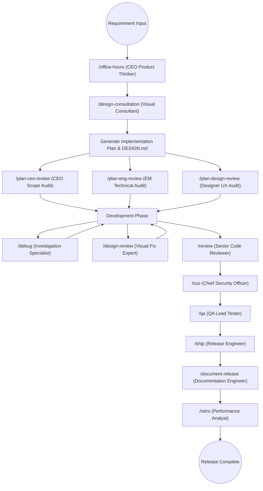

# gstack Specialist Roles Collaboration Workflow Analysis

The essence of gstack lies not just in the professionalism of individual roles, but in how these 13 roles work together like a real "Virtual Engineering Lab." This report showcases their division of labor and collaboration through a **Full Life-Cycle View**.

---

## 1. Collaboration Overview Diagram (Mermaid)

The following diagram illustrates the hand-off process an engineering feature undergoes from "Concept" to "Final Release":



### B. Text-based Workflow Diagram

If your editor cannot render Mermaid, refer to the text diagram below:

```text
    [ Requirement Input ]
         |
         v
    [/office-hours] (CEO Concept) ----> [ Output: DESIGN.md & Plan ]
         |                                |
         +---------------|----------------+
                         v
                [ Triple Combined Audit Gate ]
      +------------------+------------------+------------------+
      | [/plan-ceo]      | [/plan-eng]      | [/plan-design]   |
      | (Product Value)  | (Arch/Tests)     | (UI/UX Soul)     |
      +------------------+------------------+------------------+
                         |
                         v
                  [ Implementation ] <-------- [/debug] (Investigation)
                         |           <-------- [/design-review] (Visual Fix)
                         v
                  [ Pre-merge Filter ]
      +------------------+------------------+------------------+
      | [/review]        | [/cso]           | [/qa]            |
      | (Code Logic)     | (Security)       | (Browser Tests)  |
      +------------------+------------------+------------------+
                         |
                         v
                  [/ship] (Release Eng) ----> [ Merge / Update CHANGELOG / PR ]
                         |
                         v
                  [/document-release] (Doc Eng)
                         |
                         v
                  [/retro] (Performance) ----> [ Weekly Report / Nav Data ]
```

---

## 2. Deep Dive into Collaboration Phases

### A. Ideation Phase: CEO & Visual Consultation
- **Collaboration**: `/office-hours` solidifies vague visions into a "Problem Statement"; `/design-consultation` follows by dressing that statement in a "Visual Identity."
- **Output**: The duo collaborates to produce `DESIGN.md` and `IMPLEMENTATION_PLAN.md`.

### B. Triple Logic Gate: Decentralized Checks
- **Collaboration**: gstack forbids a single "boss" decision.
    - **CEO** cuts unrealistic fantasies.
    - **EM** locks down the tech stack and test matrix.
    - **Designer** ensures UX isn't sacrificed for dev convenience.
- **Significance**: This concurrent review ensures the plan reaches "10-star" standards before a single line is coded.

### C. Quality Gatekeeping: Adversarial Audit
- **Collaboration**: After PR submission, `/review`, `/cso`, and `/qa` form a filter funnel.
    - `/review` finds logic bugs.
    - `/cso` finds security backdoors.
    - `/qa` performs the final "Reality Check" via a Chromium browser.

### D. Closing the Loop: Automation & Retrospection
- **Collaboration**: Once `/ship` completes the distribution, it triggers `/document-release` to sync docs and populates the weekly navigation data for `/retro`.

---

## 3. The "Hidden Assets" of Collaboration

1. **Shared Context**: All roles sync via three core files: `CLAUDE.md`, `DESIGN.md`, and `TODOS.md`.
2. **Adversarial Mindset**: Every step has an expert "responsible for finding problems" and an expert "responsible for solving them." This **unity of opposites** is key to avoiding AI hallucinations and quality degradation.
3. **Standard Vocabulary**: gstack creates a shared language (e.g., Boil the Lake, Nuclear Scope, Pixel Perfect) for high-efficiency cross-role communication.

---
*Analysis Report Complete.*
