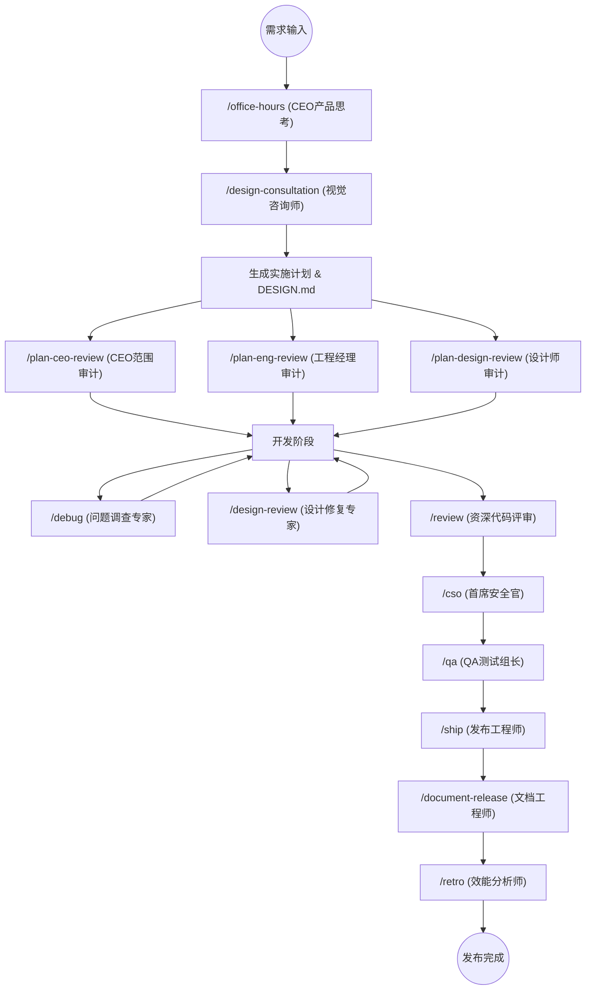

# gstack 13 专家角色协作工作流深度分析报告

gstack 的精髓不仅仅在于单个角色的专业性，更在于这 13 个角色如何像一个真实的“虚拟工程实验室”一样串联工作。本报告将通过**全生命周期视图**展示其分工与协作。

---

## 1. 协作全景流程图 (Mermaid)

以下图表展示了一个功能从“构思”到“最终发布”所经历的专家手递手流程：



### B. 文本简易流程图 (Text-based Workflow)

如果您所在的编辑器无法渲染 Mermaid，请参考下方的文本示意图：

```text
    [ 需求输入 ]
         |
         v
    [/office-hours] (CEO 构思) ----> [ 产生: DESIGN.md & 计划 ]
         |                                |
         +---------------|----------------+
                         v
                [ 三重联合审计门禁 ]
       +------------------+------------------+------------------+
       | [/plan-ceo]      | [/plan-eng]      | [/plan-design]   |
       | (产品价值)        | (架构/测试)       | (UI/UX 灵魂)     |
       +------------------+------------------+------------------+
                         |
                         v
                  [ 编码实施阶段 ] <-------- [/debug] (调查专家)
                         |         <-------- [/design-review] (视觉修复)
                         v
                  [ 合并前审计漏斗 ]
       +------------------+------------------+------------------+
       | [/review]        | [/cso]           | [/qa]            |
       | (代码逻辑)        | (安全官)         | (浏览器测试)      |
       +------------------+------------------+------------------+
                         |
                         v
                  [/ship] (发布工程师) ----> [ 合并 / 更新 CHANGELOG / 开 PR ]
                         |
                         v
                  [/document-release] (文档工程师)
                         |
                         v
                  [/retro] (效能分析师) ----> [ 生成周报 / 同步航行数据 ]
```

---

## 2. 核心协作阶段详解

### A. 创意孵化阶段：CEO 与视觉咨询
- **协作点**：`/office-hours` 负责将模糊的愿景固化为“问题陈述”；`/design-consultation` 紧随其后，为该陈述穿上“视觉外衣”。
- **产出**：两者协作产生 `DESIGN.md` 与 `IMPLEMENTATION_PLAN.md`。

### B. 三重逻辑大闸：分权制衡
- **协作点**：gstack 严禁一个人说了算。
    - **CEO** 负责砍掉不切实际的幻想。
    - **EM** 负责锁死技术栈和测试计划。
    - **设计师** 负责确保 UX 不会因为开发便利而被牺牲。
- **意义**：这三者的并发评审确保了计划在真正动工前已达到“十星级”标准。

### C. 质量守门环节：Adversarial Audit (对抗式审计)
- **协作点**：在 PR 提交后，`/review`、`/cso` 和 `/qa` 构成了一套漏斗模型。
    - `/review` 找逻辑 Bug。
    - `/cso` 找安全后门。
    - `/qa` 通过 Chromium 浏览器进行最终的“真实性检验”。

### D. 闭环归档：自动化与复盘
- **协作点**：当 `/ship` 完成最后的一键分发后，它会自动触发 `/document-release` 同步文档，并为 `/retro` 积累本周的航行数据。

---

## 3. 协作背后的“隐形资产”

1. **共享上下文**：全角色通过 `CLAUDE.md`、`DESIGN.md` 和 `TODOS.md` 三大核心文件保持同步。
2. **对抗性思维**：每一个环节都有“负责发现问题”的专家和“负责解决问题”的专家，这种角色的**对立统一**是避免 AI 幻觉和质量滑坡的关键。
3. **标准语库**：gstack 创造了一套标准词汇（如：Boil the Lake, Nuclear Scope, Pixel Perfect），让跨角色的沟通极其高效。

---
*分析报告已完成。*
