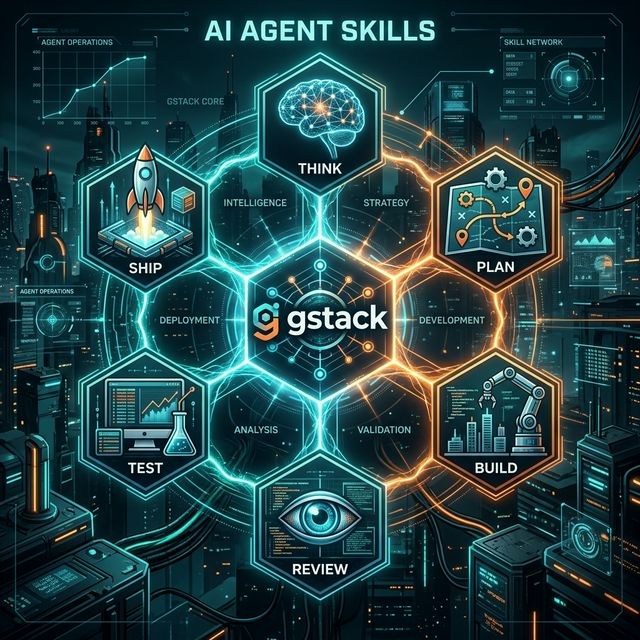

# 🌌 gstack Specialist: Elite Engineering Engine

<div align="center">



</div>

A structured 6-phase development sprint: **Think → Plan → Build → Review → Test → Ship**. Role-based subagents at each phase. Inspired by [Garry Tan's gstack](https://github.com/garrytan/gstack).

Works with any [Agent Skills](https://agentskills.io) compatible tool: Claude Code, OpenAI Codex, Trae, Cursor, Gemini CLI, and more.

## What This Is

[gstack](https://github.com/garrytan/gstack) is Garry Tan's (CEO of Y Combinator) open-source software factory for Claude Code — 15 specialist roles and 6 power tools that turn Claude Code into a virtual engineering team.

This skill takes gstack's core insight — **structured roles beat generic prompting** — and packages it as a portable Agent Skill that works across 20+ AI coding tools, not just Claude Code.

**What we kept from gstack:**
- The Think → Plan → Build → Review → Test → Ship workflow
- Role-based subagent spawning (YC Coach, Eng Manager, Staff Engineer, QA Lead, Release Engineer)
- Design doc as the central artifact that flows between phases
- Paranoid review culture

**What we changed:**
- Simplified from 15 skills to 6 phases (most people don't need all 15)
- Made it tool-agnostic via Agent Skills standard
- Focused on solo dev / small team use case
- Added model selection guidance per phase

## Phases

| # | Phase | Role | Spawns | Output |
|---|-------|------|--------|--------|
| 1 | **Think** | YC Office Hours Coach | Sonnet | `DESIGN.md` |
| 2 | **Plan** | Eng Manager | Sonnet | `PLAN.md` |
| 3 | **Build** | Implementer | Haiku/Sonnet | Code + Tests |
| 4 | **Review** | Staff Engineer | Sonnet | Review Report |
| 5 | **Test** | QA Lead | Sonnet | Bug Report + Fixes |
| 6 | **Ship** | Release Engineer | Haiku | PR / Deploy |

## Install

### Manual (Local Development)
Clone this repository and copy the `skills` directory to your agent's skill path:

```bash
# Clone
git clone https://github.com/lee-jet/gstack-ai-roles.git

# Install to Claude Code
cp -r gstack-ai-roles/skills ~/.claude/skills/gstack-ai-roles

# Install to Codex / generic tools
cp -r gstack-ai-roles/skills ~/.codex/skills/gstack-ai-roles

# For Cursor / Windsurf / Trae
# Simply point the tool to the /skills directory in this repo.
```

## 🎮 Engineering Triggers (Usage)

The `gstack-ai-roles` engine is triggered by natural language intentions or explicit slash-commands.

### 🖥️ End-to-End Orchestration (The Factory Line)
Automate the entire 6-unit lifecycle from a high-level vision to production.
- "Construct a [feature name] from ground zero"
- "Trigger the gstack-ai-roles factory for [project idea]"
- "Initialize a production-grade [module] and run it through all audit gates"

### 🚦 Advanced State Recovery (Zero-Waste Engine)
The engine detects existing `DESIGN.md` or `PLAN.md` artifacts and resumes only the necessary units.
- "The architectural plan is locked; proceed to Build and Review"
- "Implementation complete; perform adversarial audit and ship to prod"
- "Rescue this branch: audit current code and generate regression tests"

### 🧩 Manual Unit Invocation
Trigger specialized sub-agents for specific engineering tasks:
- `/think [concept]` — Deep-dive first principles analysis and `DESIGN.md`
- `/plan` — System-wide topology and state-machine design (`PLAN.md`)
- `/review` — Strict logic and security audit (Staff Engineer mode)
- `/ship` — Final governance, rebase, and release synchronization

## How It Works

Each phase spawns a focused subagent with a specialized prompt. The subagent works in isolation, produces a structured artifact, and passes it to the next phase.

```
User idea → DESIGN.md → PLAN.md → Code → Review → Tests → PR
           (Think)     (Plan)    (Build) (Review) (Test)  (Ship)
```

Key principle: **no code until the plan is approved**. Challenge scope ruthlessly.

## Frameworks Used

- **YC Office Hours** — reframing problems before solving them
- **Amazon Working Backwards** — press release before PRD
- **INVEST** — user story quality criteria
- **RICE** — feature prioritization

## Credit

This directory contains the **gstack-ai-roles** engine, a highly optimized 6-phase engineering production system inspired by gstack's core philosophy.

## Related

- [gstack](https://github.com/garrytan/gstack) — The original "Boil the Lake" software factory
- [Agent Skills Spec](https://agentskills.io/specification) — The open standard for AI Agent Skills

## License

MIT
